# BMC HelixOM OnPrem Installation Step by Step 1 - Prepare the environment

- [BMC HelixOM OnPrem Installation Step by Step 1 - Prepare the environment](#bmc-helixom-onprem-installation-step-by-step-1---prepare-the-environment)
  - [1 Architecture Diagram](#1-architecture-diagram)
  - [2 Install VMs for Helix](#2-install-vms-for-helix)
  - [3 Install Docker Environment](#3-install-docker-environment)
  - [4 Prepare a self-signed certificate)](#4-prepare-a-self-signed-certificate)
  - [5 Setup Harbor Registry)](#5-setup-harbor-registry)
  - [6 Setup Kubernetes Cluster)](#6-setup-kubernetes-cluster)

## 1 Architecture Diagram
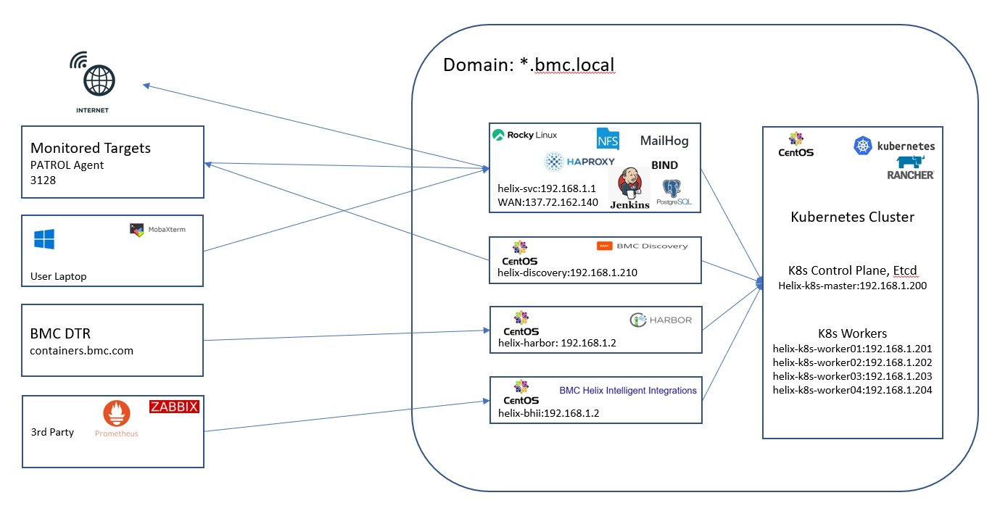


## 2 Install VMs for Helix

### 2.1 Helix VM List

| No. | VM Host Name | IP | OS | Sizing | Description | Software Installed |
| --- | --- | --- | --- | --- | --- | --- |
| 1 | helix-svc.bmc.local | 192.168.1.1 | Rocky9 | 4 vCPU * 8 GB RAM * 500 HDD | Helix Install workstations and auxiliary services | DNS/NFS/HAProxy/eMail |
| 2 | helix-harbor.bmc.local | 192.168.1.2 | Rocky9 | 2 vCPU * 4 GB RAM * 500 HDD | Container Image Registry |Harbor |
| 3 | helix-k8s-master.bmc.local | 192.168.1.200 | Rocky9 | 4 vCPU * 8 GB RAM * 100 HDD | k8s master node | rancher master pod |
| 4 | helix-k8s-worker01.bmc.local | 191.168.1.201 | Rocky9 | 16 vCPU * 64 GB RAM * 100 HDD | k8s worker node 1 | rancher worker pod |
| 5 | helix-k8s-worker02.bmc.local | 191.168.1.202 | Rocky9 | 16 vCPU * 64 GB RAM * 100 HDD | k8s worker node 2 | rancher worker pod |
| 6 | helix-k8s-worker03.bmc.local | 191.168.1.203 | Rocky9 | 16 vCPU * 64 GB RAM * 100 HDD | k8s worker node 3 | rancher woker pod |
| 7 | helix-k8s-worker04.bmc.local | 191.168.1.204 | Rocky9 | 16 vCPU * 64 GB RAM * 100 HDD | k8s worker node 4 | rancher worker pod |
| 8 | helix-discovery.bmc.local | 191.168.1.210 | OLinux9 | 4 vCPU * 4 GB RAM * 65 HDD | Discovery VM | Discovery VM |

### 2.2 Helix Domain Name List

| No. | Domain Name | IP | Category |
| --- | --- | --- | --- |
| 1 | helix-svc.bmc.local | 192.168.1.1 | VM Domain Name|
| 2 | helix-harbor.bmc.local | 192.168.1.2 | VM Domain Name |
| 3 | helix-k8s-master.bmc.local | 192.168.1.200 | VM Domain Name |
| 5 | helix-k8s-worker01.bmc.local | 192.168.1.201 | VM Domain Name |
| 6 | helix-k8s-worker02.bmc.local | 192.168.1.202 | VM Domain Name |
| 8 | helix-k8s-worker03.bmc.local | 192.168.1.203 | VM Domain Name |
| 9 | helix-k8s-worker03.bmc.local | 192.168.1.203 | VM Domain Name |
| 10 | helix-k8s-worker03.bmc.local | 192.168.1.210 | VM Domain Name|
| 11 | smtp.bmc.local | 192.168.1.1 | ITOM Domain Name |
| 12 | lb.bmc.local | 192.168.1.1 | ITOM Domain Name |
| 13 | tms.bmc.local | 192.168.1.1 | ITOM Domain Name |
| 14 | minio.bmc.local | 192.168.1.1 | ITOM Domain Name|
| 15 | minio-api.bmc.local | 192.168.1.1 | ITOM Domain Name |
| 16 | kibana.bmc.local | 192.168.1.1 | ITOM Domain Name |
| 16 | adelab-private-poc.bmc.local | 192.168.1.1 | ITOM Domain Name |
| 16 | adelab-disc-private-poc.bmc.local | 192.168.1.210 | ITOM Domain Name |
| 17 | itsm-poc.bmc.local | 192.168.1.1 | ITSM Domain Name |
| 18 | itsm-poc-int.bmc.local | 192.168.1.1 | ITSM Domain Name |
| 19 | itsm-poc-smartit.bmc.local | 192.168.1.1 | ITSM Domain Name|
| 20 | itsm-poc-sr.bmc.local | 192.168.1.1 | ITSM Domain Name |
| 21 | itsm-poc-is.bmc.local | 192.168.1.1 | ITSM Domain Name |
| 22 | itsm-poc-restapi.bmc.local | 192.168.1.1 | ITSM Domain Name |
| 23 | itsm-poc-atws.bmc.local | 192.168.1.1 | ITSM Domain Name |
| 24 | itsm-poc-dwp.bmc.local | 192.168.1.1 | ITSM Domain Name |
| 25 | itsm-poc-dwpcatalog.bmc.local | 192.168.1.1 | ITSM Domain Name |
| 26 | itsm-poc-vchat.bmc.local | 192.168.1.1 | ITSM Domain Name |
| 27 | itsm-poc-chat.bmc.local | 192.168.1.1 | ITSM Domain Name|
| 28 | itsm-poc-supportassisttool.bmc.local | 192.168.1.1 | ITSM Domain Name |


### 2.3 Install VM
During the installation of Linux, when creating a disk partition, delete the/home directory, rebuild the root directory, and allocate all remaining disk space to the root directory
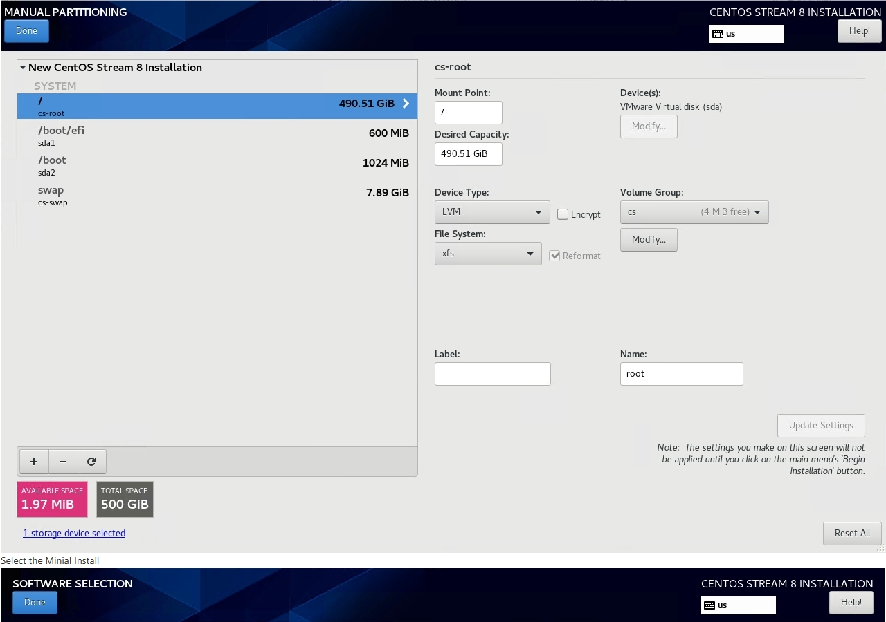
Select the Minial Install
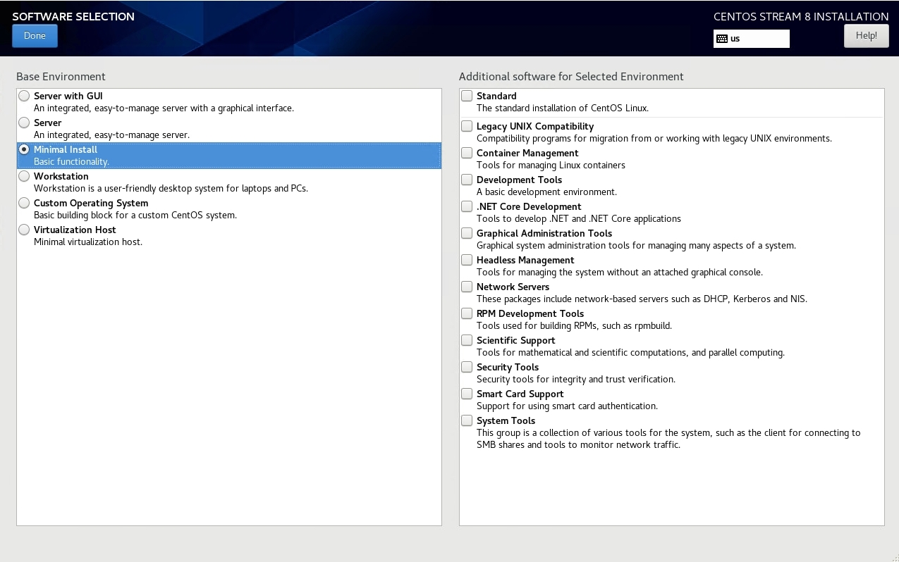


### 2.4 Config helix-svc VM
helix-svc is the auxiliary server providing peripheral services for Helix OnPrem.

* Gateway for all other VMs
* DNS Server
* eMail Server
* NFS Server
* Load Balancer Server

#### 2.4.1 Setup Network

To reduce network address usage, all servers in the Helix cluster are configured on the intranet IP address segment 192.168.1.1/24. Only the helix-svc server is configured with dual network cards, connecting to the internal and external networks respectively. All other virtual machines are configured with a single network card, connected to the LAN network k8s-internal.

* The WAN network card is responsible for providing Internet access services for other VMs and Helix clusters.
* The LAN network card is responsible for forwarding external service requests

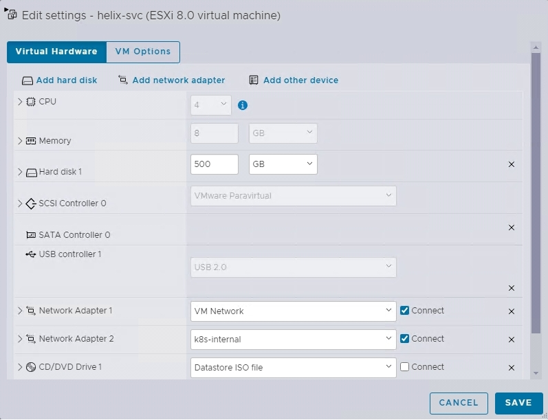

Set ntwrok via command
```
nmtui-edit
```

The popup view
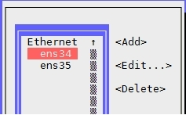

Edit the external network card ens34 and modify the following content:

* Check the "Ignorre automatically obtained DNS parameters" option
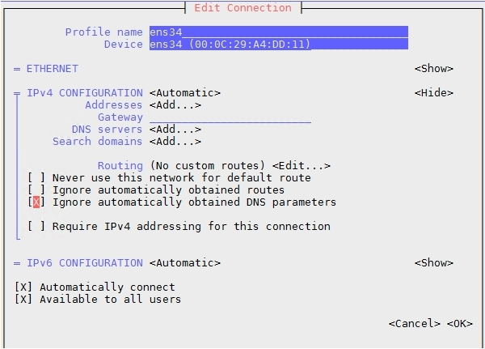

Edit the intranet card ens35 and modify the following content:

* IPv4 Configuration: Manual
* DNS: 127.0.0.1
* Search domains: bmc.local
* Check the“Never use this network for default route”option


Restart Network
```
systemctl restart NetworkManager
```
#### 2.4.2 Setup firewalld

Create internal and external zone

```
nmcli connection modify ens34 connection.zone external
nmcli connection modify ens35 connection.zone internal
```

View zones:

```
firewall-cmd --get-active-zones
```


Set masquerading (source-nat) on the both zones

```
firewall-cmd --zone=external --add-masquerade --permanent
firewall-cmd --zone=internal --add-masquerade --permanent
firewall-cmd --reload
```

Check the current settings of each zone
```
firewall-cmd --list-all --zone=internal
firewall-cmd --list-all --zone=external
cat /proc/sys/net/ipv4/ip_forward
```
#### 2.4.3 Setup DNS

Install and configure BIND DNS
```
dnf install bind bind-utils -y
```

Download config files for each of the services
```
dnf install git -y
git clone https://github.com/rivertb/BMC-Helix-OnPrem-Installation-1-Env
```


Apply configuration
```
\cp ~/BMC-Helix-OnPrem-Installation-1-Env/dns/named.conf /etc/named.conf
cp -R ~/BMC-Helix-OnPrem-Installation-1-Env/dns/zones /etc/named/
```
Configure the firewall for DNS
```
firewall-cmd --add-service=dns --zone=external --permanent 
firewall-cmd --add-service=dns --zone=internal --permanent 
firewall-cmd --reload
```
Assign source IP network ranges
```
firewall-cmd --add-source=192.168.1.0/24 --zone=external --permanent 
firewall-cmd --add-source=192.168.1.0/24 --zone=internal --permanent
firewall-cmd --reload
```
Enable and start the service
```
systemctl enable named
systemctl start named
systemctl status named
```
Restart Network Manager
```
systemctl restart NetworkManager
```
Confirm dig now sees the correct DNS results by using the DNS Server running locally
```
dig lb.bmc.local
dig -x 192.168.1.1
```

#### 2.4.4 Setup JDK
```
yum install java-11-openjdk -y
ls /usr/lib/jvm/jre-11-openjdk
```

### 2.5 Setup network for other VMs 
For servers other than helix-svc, configure the following:

* IPv4 Configuration: Manual
* Addresses: Assign IP addresses to VMs according to the table definition in 2.1.
* Gateway:192.168.1.1
* DNS Server:192.168.1.1
* Search dommains: bmc.local
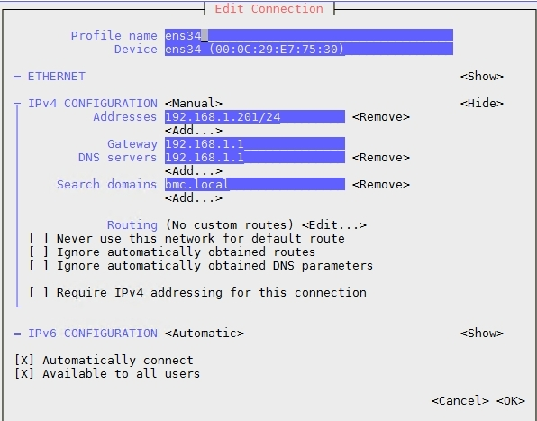

Verify that external network access is successful
```
dig www.baidu.com
```

Verify that the local DNS can resolve the local domain name
```
dig lb.bmc.local
dig -x 192.168.1.1
```

### 2.6 Adjusting Linux Configuration
```
#Update OS
dnf update -y

# Close firewalld
systemctl stop firewalld
systemctl disable firewalld

#Disable SELinux
setenforce 0
sed -i 's#SELINUX=enforcing#SELINUX=disabled#g' /etc/sysconfig/selinux
sed -i 's#SELINUX=enforcing#SELINUX=disabled#g' /etc/selinux/config

# Swapoff swap
swapoff -a && sysctl -w vm.swappiness=0
sed -ri '/^[^#]*swap/s@^@#@' /etc/fstab

#Set time zone
timedatectl set-timezone Asia/Shanghai 

#Time sync
yum install -y chrony
systemctl start chronyd
systemctl enable chronyd

chronyc sources -V

#Set kernel parameters
ulimit -SHn 65535

cat <<EOF >> /etc/security/limits.conf
* soft nofile 655360
* hard nofile 131072
* soft nproc 655350
* hard nproc 655350
* soft memlock unlimited
* hard memlock unlimited
EOF

#Take the adjust to effect
reboot
```
## 3. Install Docker Environment 

### 3.1 Install Docker Engine

   Install Docker on all VMs. For installation instructions, refer to：[Install Docker Engine](https://docs.docker.com/engine/install/)
    
 Select different installation methods according to the type of the current operating system. For example, for CentOS:
```
#Uninstall old versions
sudo dnf remove docker \
                  docker-client \
                  docker-client-latest \
                  docker-common \
                  docker-latest \
                  docker-latest-logrotate \
                  docker-logrotate \
                  docker-engine

#Set up the repository
sudo dnf -y install dnf-plugins-core
sudo dnf config-manager --add-repo https://download.docker.com/linux/centos/docker-ce.repo

#Install Docker Engine Latest version
sudo dnf install docker-ce docker-ce-cli containerd.io docker-buildx-plugin docker-compose-plugin -y

#Start Docker Engine.
sudo systemctl enable --now docker   

#Verify that the installation is successful by running the hello-world image:
sudo docker run hello-world

```

### 3.2 Install Docker Compose
Install Docker Compose on helix-harbor and helix-bhii，For installation instructions, refer to：[Install the Docker Compose standalone](https://docs.docker.com/compose/install/standalone/)
   
   
```
#To download and install the Docker Compose standalone
curl -SL https://github.com/docker/compose/releases/download/v2.33.1/docker-compose-linux-x86_64 -o /usr/local/bin/docker-compose

#Apply executable permissions
chmod +x /usr/local/bin/docker-compose

#Create a symbolic link
sudo ln -s /usr/local/bin/docker-compose /usr/bin/docker-compose

#Test and execute Docker Compose
docker-compose
```
            
 ## 4 Prepare a self-signed certificate
###  4.1 Create a certificate
 
 On the helix-svc server, create a CA certificate and a self-signed certificate
```
su - root
mkdir openssl
cd openssl
cp ~/BMC-Helix-OnPrem-Installation-1-Env/certs/create_certs.sh .
chmod a+x *.sh

# Execute the script to create the Helix root certificate and self-signed certificate
./create_certs.sh

ll			

-rwxr-xr-x 1 root root 1816 Feb 27 13:24 create_certs.sh
-rw------- 1 root root 3247 Feb 27 13:24 HelixCA.key
-rw-r--r-- 1 root root 1895 Feb 27 13:24 HelixCA.crt
-rw------- 1 root root 1679 Feb 27 13:24 bmc.local.key
-rw-r--r-- 1 root root  223 Feb 27 13:24 bmc.local.cnf
-rw-r--r-- 1 root root 1094 Feb 27 13:24 bmc.local.csr
-rw-r--r-- 1 root root   41 Feb 27 13:24 HelixCA.srl
-rw-r--r-- 1 root root 1574 Feb 27 13:24 bmc.local.crt
```

### 4.2 Set up ssh password-free login
```
cd /root
ssh-keygen -t rsa

for i in helix-svc helix-harbor helix-k8s-master helix-k8s-worker01 helix-k8s-worker02 helix-k8s-worker03 helix-k8s-worker04;do ssh-copy-id -i .ssh/id_rsa.pub $i;done
```

### 4.3 Set trusted certificate

Add the certificate to all servers
```
cd /root/openssl
for node in helix-svc helix-harbor helix-k8s-master helix-k8s-worker01 helix-k8s-worker02 helix-k8s-worker03 helix-k8s-worker04; do echo $node; scp HelixCA.crt root@$node:/etc/pki/ca-trust/source/anchors/; ssh root@$node "update-ca-trust enable;update-ca-trust extract;systemctl restart docker";done
```
## 5 Setup Harbor Registry
### 5.1 Harbor Installation

* Prepare https certificate for Harbor
```
#Configure Harbor registry by using self-signed SSL certificates
mkdir -p /data/cert
scp root@helix-svc:/root/openssl/bmc.local.crt /data/cert/
scp root@helix-svc:/root/openssl/bmc.local.key /data/cert/
scp root@helix-svc:/root/openssl/HelixCA.crt /data/cert/

#Convert yourdomain.com.crt to yourdomain.com.cert, for use by Docker
cd /data/cert
openssl x509 -inform PEM -in bmc.local.crt -out bmc.local.cert

#Copy the server certificate, key and CA files into the Docker certificates folder on the Harbor host.
#mkdir -p /etc/docker/certs.d/yourdomain.com/
mkdir -p /etc/docker/certs.d/bmc.local/

cp /data/cert/bmc.local.cert /etc/docker/certs.d/bmc.local/
cp /data/cert/bmc.local.key /etc/docker/certs.d/bmc.local/
cp /data/cert/HelixCA.crt /etc/docker/certs.d/bmc.local/

#Restart Docker Engine.
systemctl restart docker
```

* Install the harbor image registry on helix-harbor. For installation instructions, please refer to：[Create a Harbor registry](https://docs.bmc.com/xwiki/bin/view/IT-Operations-Management/On-Premises-Deployment/BMC-Helix-IT-Operations-Management-Deployment/itomdeploy251/Deploying/Preparing-for-deployment/Accessing-container-images/Setting-up-a-Harbor-registry-in-a-local-network-and-synchronizing-it-with-BMC-DTR/)。

```
# Download Harbor
dnf install wget -y
#wget https://github.com/goharbor/harbor/releases/download/v<version>/harbor-offline-installer-v<version>.tgz

# Example
wget https://github.com/goharbor/harbor/releases/download/v2.1.4/harbor-offline-installer-v2.1.4.tgz

# Unzip the tar file
tar xvzf harbor-offline-installer*.tgz

# Go to the Harbor directory
cd harbor

# Copy the configuration template
cp harbor.yml.tmpl harbor.yml

```

* in the harbor.yml file, update the values for the following parameters:

```
# Specify the name of system where you want to install Harbor.
hostname: helix-harbor.bmc.local

# Specify the password for the Harbor system administrator.
harbor_admin_password: bmcAdm1n

# The path of cert and key files for nginx
certificate: /data/cert/bmc.local.crt
private_key: /data/cert/bmc.local.key

# Harbor repository
data_volume: /data/harbor

```

* install the Harbor registry
```
mkdir /data/harbor
./install.sh
```


* Configure the Harbor registry
Log in to the Harbor registry and perform the following steps to create a new project:

Select Projects and then click NEW PROJECT.
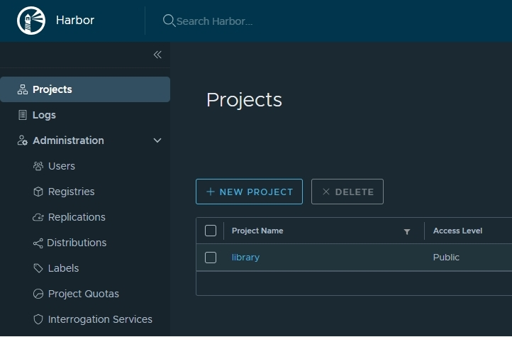

In the New Project window, specify the following values:
Project Name: Enter bmc.
Access Level: Select the Public check box.
Leave the other parameters to their default values.
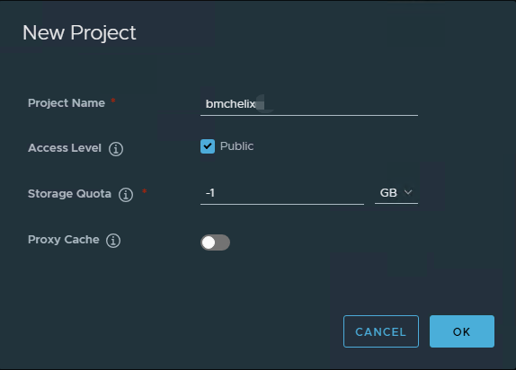
Click OK
    

### 5.2 Batch download Helix images
This step can be performed on any server that can connect to the Internet, not just the helix-harbor server. The prerequisite is docker engine environment.

* Create Helix images download directory

```
cp -R ~/BMC-Helix-OnPrem-Installation-1-Env/helix-images-25.1  /root/.

```
* Download Helix ITOM all_images_<version>.txt file from BMC Docs to root/helix-images-25.1
    [all_images_25.1.txt](https://docs.bmc.com/xwiki/bin/view/IT-Operations-Management/On-Premises-Deployment/BMC-Helix-IT-Operations-Management-Deployment/itomdeploy251/Deploying/Preparing-for-deployment/Accessing-container-images/Setting-up-a-Harbor-registry-in-a-local-network-and-synchronizing-it-with-BMC-DTR/)
    
 
```
pwd
/root/helix-images-25.1

ls -l
-rw-r--r-- 1 root root 13685 Feb 25 15:55 all_images_25.1.00.txt
-rw-r--r-- 1 root root  2158 Feb 25 15:44 helix-load-images.sh
-rw-r--r-- 1 root root  2399 Feb 25 15:44 helix-save-images.sh
-rw-r--r-- 1 root root   174 Feb 25 15:44 saveall.sh

# Convert the file to an UNIX format
dnf install dos2unix -y
dos2unix all_images_25.1.00.txt

# Get Helix ITOM different repository images lists

# lp0lz: BMC Helix Platform images
cat all_images_25.1.00.txt | grep lp0lz > lp0lz_images.txt

# lp0oz: BMC Helix Intelligent Automation images
cat all_images_25.1.00.txt | grep lp0oz > lp0oz_images.txt

# lp0pz: BMC Helix Continuous Optimization images
cat all_images_25.1.00.txt | grep lp0pz > lp0pz_images.txt

# lp0mz: BMC Helix Operations Management on-premises images
cat all_images_25.1.00.txt | grep lp0mz > lp0mz_images.txt

# la0cz: BMC Helix AIOps images
cat all_images_25.1.00.txt | grep la0cz > la0cz_images.txt

# Run batch downloader for Helix ITOM image
chmod a+x *.sh
nohup ./saveall.sh > nohup.out &
tail -f nohup.out

# Due to the limitation of network speed, the entire download process may take several hours to several days.
```

### 5.3 Download Rancher image files

In this test, the Kubernetes cluster where Helix installed is created and managed using Rancher. The following steps are to prepare the Rancher image file.

This step can be performed on any server that can connect to the Internet, not just the helix-harbor server. The prerequisite is docker engine environment.

To download the Rancher image file, refer to the Rancher official documentation：[Collect and Publish Images to your Private Registry](https://ranchermanager.docs.rancher.com/getting-started/installation-and-upgrade/other-installation-methods/air-gapped-helm-cli-install/publish-images)。

* Select the Rancher version, download the offline tool script file and the mirror list file, you can refer to the document：[Rancher Release](https://github.com/rancher/rancher/releases)
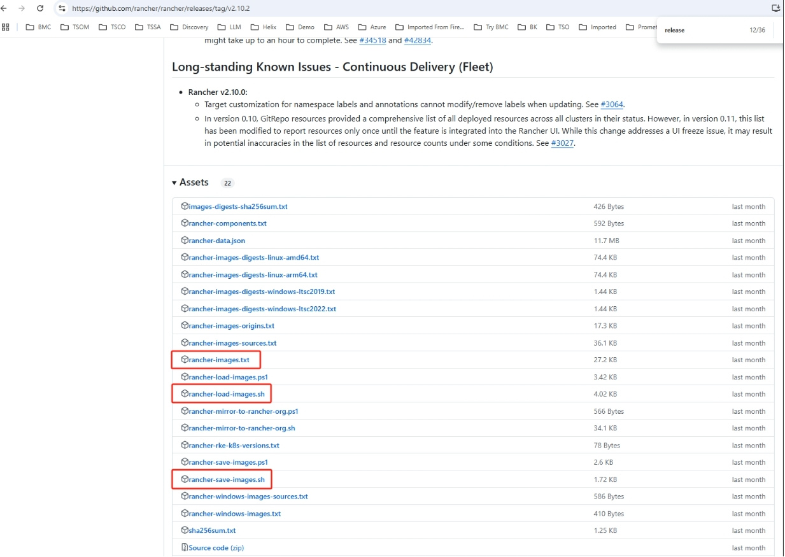

* Download Rancher image files
```
#mkdir rancher
mkdir /root/rancher-images-2.10.2

# cp rancher-images.txt, rancher-load-images.sh, rancher-save-images.sh file to /root/rancher-images-2.10.2 directory
cd /root/rancher-images-2.10.2
chmod a+x *.sh
    
ls -l
-rw-r--r-- 1 root root 27835 Feb 25 16:33 rancher-images.txt
-rwxr-xr-x 1 root root  4115 Feb 25 16:33 rancher-load-images.sh
-rwxr-xr-x 1 root root  1757 Feb 25 16:33 rancher-save-images.sh

# Sort and unique the mirror list to remove duplicate mirror sources.
sort -u rancher-images.txt -o rancher-images.txt

# Create a compressed package of the required image
nohup ./rancher-save-images.sh --image-list ./rancher-images.txt > nohup.out &

```

### 5.4 Import Helix images to harbor
Import the downloaded Helix Image image package file into the Harbor registry deployed on the helix-harbor server.
```
cd /root/helix-image-25.1
nohup ./loadall.sh > nohup.out &
tail -f nohup.out
```

### 5.5 Import Rancher images
Import the downloaded Rancher Image image package file into the Harbor registry deployed on the helix-harbor server.

* Create new project rancher

Log in to the Harbor registry and perform the following steps to create a new project:
Select Projects and then click NEW PROJECT. In the New Project window, specify the following values:

Project Name: Enter rancher.
Access Level: Select the Public check box.
Leave the other parameters to their default values.

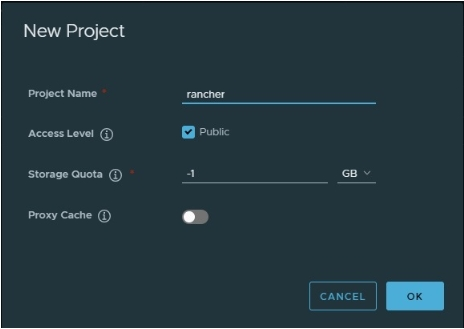

* Import Rancher Images
Use rancher-load-images.sh to extract, tag and push rancher-images.txt and rancher-images.tar.gz to harbor registry

```
# Chang to images file direcotry
cd /root/rancher-images-2.10.2

# Login to Helix Harbor Server
docker login helix-harbor.bmc.local -u admin -p bmcAdm1n

# Load Rancher images to Harbor Server
nohup ./rancher-load-images.sh --images rancher-images.tar.gz  --registry helix-harbor.bmc.local > nohup.out &
tail -f nohup.out
```
## 6 Setup Kubernetes Cluster
### 6.1 Install Rancher

* Install the containerized Rancher pod on the helix-k8s-master server

```
# Login to Harbor Server
docker login helix-harbor.bmc.local -u admin -p bmcAdm1n

# Install Rancher docker version
docker run -d --privileged --name rancher --restart=unless-stopped -p 80:80 -p 443:443 -v /opt/rancher:/var/lib/rancher -e CATTLE_SYSTEM_DEFAULT_REGISTRY=helix-harbor.bmc.local helix-harbor.bmc.local/rancher/rancher:v2.10.2
```

* Fix k3s bug in Rancher container

```
# There is a bug in the k3s, below is how to permanent fix it
# kernel modules load at startup
echo "ip_tables" | sudo tee /etc/modules-load.d/iptables.conf
echo "iptable_filter" | sudo tee -a /etc/modules-load.d/iptables.conf

# Reload systemd modules and reboot
sudo systemctl restart systemd-modules-load
sudo reboot

# Verify the modules are loaded after reboot
lsmod | grep ip
```

* Find the Rancher Console password
```
docker logs rancher 2>&1 | grep "Bootstrap Password:"
2025/02/26 04:59:02 [INFO] Bootstrap Password: 2ndg88pslbtg29xlntvqm9hwm5ggp6w8tbvmp6bxrc8wf9g8nqh7gt
```

* Login to Rancher console   

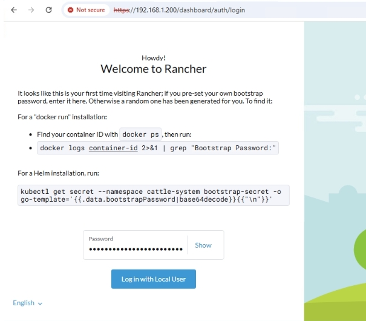


* Setup new password

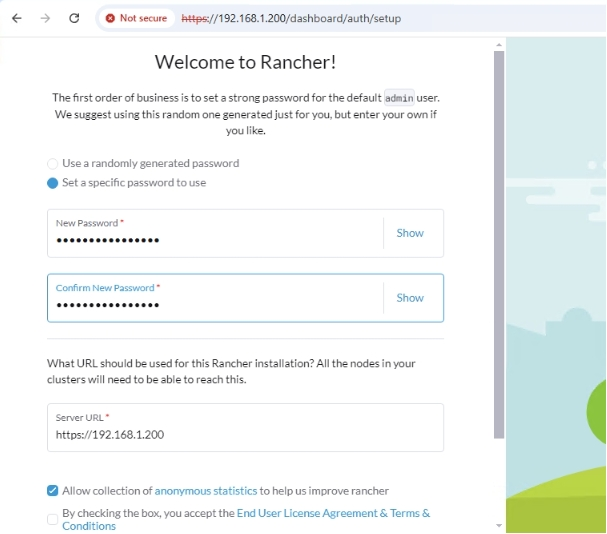


### 6.2 Create new cluster

* Log in to the Rancher console and you can see that there is only one local cluster by default. We need to create a cluster helix-compact for the installation of helix

![Rancher Create Cluster(./diagram/rancher-new-create-cluster.png)

* Select RKE1 and create a Custom cluster

![Rancher Create Custom Cluster(./diagram/rancher-create-custom-cluster.png)

* Set the cluster name to helix-compact and leave the rest of the options as default

![Rancher Cluster helix-compact(./diagram/rancher-cluster-helix-compact.png)

* Copy the script for adding a worker node

![Rancher Cluster Add Workers(./diagram/rancher-cluster-add-worker.png)

* Paste and run the script on helix-k8s-worker01 to helix-k8s-worker04 servers

```
sudo docker run -d --privileged --restart=unless-stopped --net=host -v /etc/kubernetes:/etc/kubernetes -v /var/run:/var/run  helix-harbor.bmc.local/rancher/rancher-agent:v2.10.2 --server https://192.168.1.200 --token rv6vjhfqpc9czznz7j7qt4twz7d5wjlksqjw9cbl9v96fkdxpjdz7b --ca-checksum 4a158b1469cba97e2b7d19120e449133a46edb5d7715ccb629618df27d2a073d --worker

```

* Copy the master (etcd & Control Plance) installation script

![Rancher Cluster Add Master(./diagram/rancher-cluster-add-master.png)

* Paste and execute the installation script on the helix-k8s-master server
```
sudo docker run -d --privileged --restart=unless-stopped --net=host -v /etc/kubernetes:/etc/kubernetes -v /var/run:/var/run  helix-harbor.bmc.local/rancher/rancher-agent:v2.10.2 --server https://192.168.1.200 --token rv6vjhfqpc9czznz7j7qt4twz7d5wjlksqjw9cbl9v96fkdxpjdz7b --ca-checksum 4a158b1469cba97e2b7d19120e449133a46edb5d7715ccb629618df27d2a073d --etcd --controlplane
```

* Wait for all nodes to join the cluster and the k8s cluster is created
![Rancher Cluster Nodes(./diagram/rancher-cluster-helix-compact-nodes.png)

* If the cluster installation reports an error that an image is missing, it may be that some images are missing from the rancher-images.txt file and need to be added to the local image registry. For example, if an error message is displayed saying that hyperkube:v1.31.5-rancher1 is missing, execute the following command line on the helix-harbor server.

```
docker pull rancher/hyperkube:v1.31.5-rancher1
docker tag rancher/hyperkube:v1.31.5-rancher1 helix-harbor.bmc.local/rancher/hyperkube:v1.31.5-rancher1
docker push helix-harbor.bmc.local/rancher/hyperkube:v1.31.5-rancher1
```

### 6.3 Set the k8s cluster token expiration time
The default validity period of the K8s cluster token managed by Rancher is very short, which will cause problems such as K8s monitoring failure and Helix installation pipeline errors. It is recommended to change it to never expire
![Rancher Global Setting(./diagram/rancher-global-settings.png)


### 6.4 Install Kubernetes client tools
helix-svc will be used as the Helix installation workstation, and the client tools need to be installed on this server
#### 6.4.1 kubernetes configuration file

* Copy kubeconfig file contents
![Rancher Copy kubeconfig(./diagram/rancher-copy-kubeconfig.png)

* Save to helix-svc
```
mkdir -p ~/.kube
cd ~/.kube
vi config

# Paste the clipboard contents and save
    ```

#### 6.4.2 Install kubectl

* Install kubectl on the helix-svc server that matches the Kubernetes version

```
curl -o /usr/local/bin/kubectl -LO https://storage.googleapis.com/kubernetes-release/release/v1.31.0/bin/linux/amd64/kubectl && chmod +x /usr/local/bin/kubectl

#Verifiy kubectl
kubectl version
kubectl get nodes
kubectl top nodes
    ```

* Create the namespace helixade used by ITOM and the namespace helixis used by ITSM
```
kubectl create ns helixade
kubectl create ns helixis
```

#### 6.4.2 Install helm

* Install the latest version of helm on the helix-svc server

```
#Deploy helm
curl -fsSL -o get_helm.sh https://raw.githubusercontent.com/helm/helm/main/scripts/get-helm-3
chmod 700 get_helm.sh
./get_helm.sh
```
